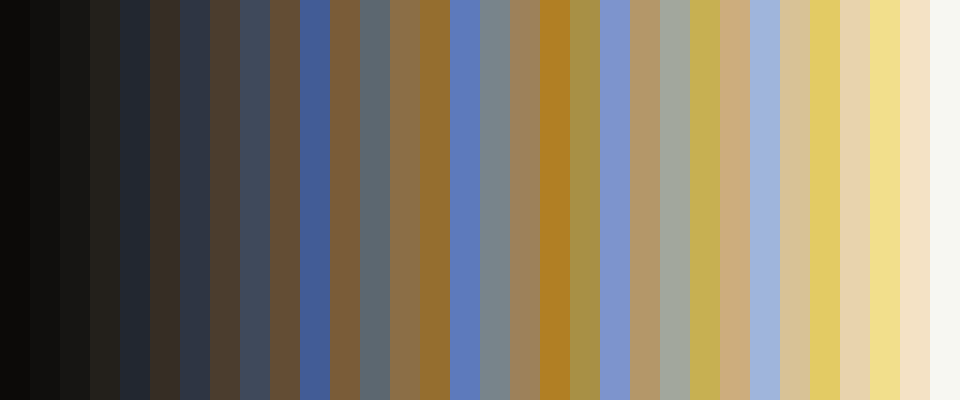

# Saving colorschemes

## Saving colorschemes as images

Sometimes you want to save a colorscheme, which is usually just a pixel thick, as a swatch or image. You can do this with `colorscheme_to_image()`. The second argument is the number of repetitions of each color in the row, the third is the total number of rows. The function returns an image which you can save using FileIO's `save()`:

```
using FileIO, ColorSchemeTools, Images, Colors

img = colorscheme_to_image(ColorSchemes.vermeer, 150, 20)
save("/tmp/cs_vermeer-150-20.png", img)
```



The `image_to_swatch()` function extracts a colorscheme from the image in and saves it as a swatch in a PNG.

```
image_to_swatch("/tmp/input.png", 10, "/tmp/output.png")
```


```@docs
colorscheme_to_image
image_to_swatch
```

## Saving colorschemes to text files

You can save a colorscheme as a text file with the imaginatively-titled `colorscheme_to_text()` function.

Remember to make the name a Julia-friendly one, because it will become a symbol and a dictionary key.

```
colorscheme_to_text(ColorSchemes.vermeer,
        "the_lost_vermeer",           # name
        "/tmp/the_lost_vermeer.jl",   # filename
        category="dutch painters",    # category
        notes="it's not really lost"  # notes
        )
```

Of course, if you just want the color definitions, you can simply type:

```
map(println, ColorSchemes.vermeer.colors);
```

```@docs
colorscheme_to_text
```
